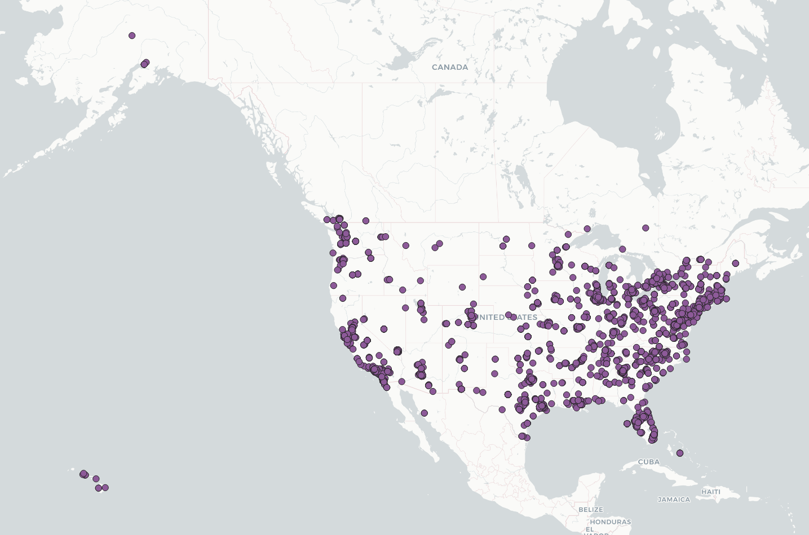
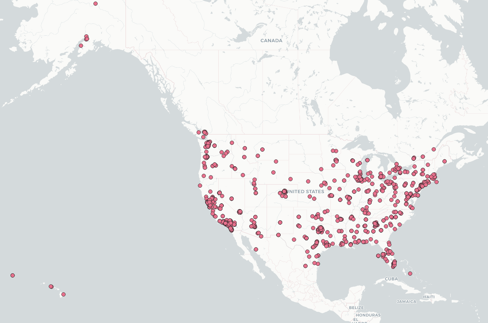
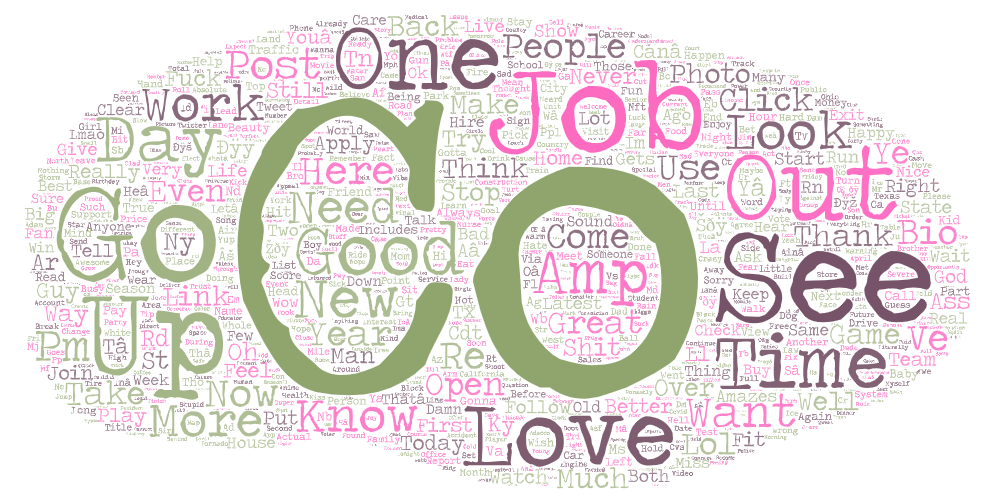
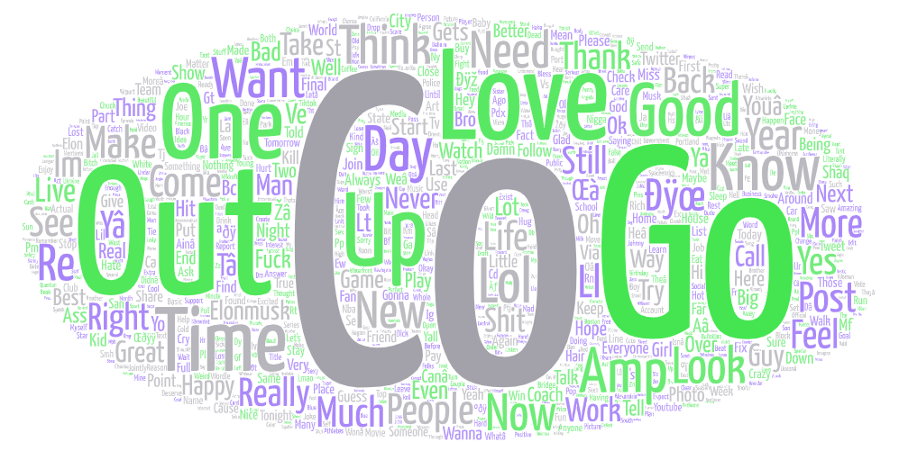

# GEOG-458-LAB 2

In this lab, we will explore the difference between two sets of tweets collected using our automated geo-tweet tool. This tool simply listens for tweets occuring within a certain geographical area, and then downloads them to a csv file. I have run this tool 2 times, 15 days apart. Giving about 3600 tweets in the first batch, and 1830 in the next.

We will explore the difference between these two datasets.

## Time Period
The greatest difference between these two datasets is the amount of tweets collected. The first batch was collected around 5pm, peak evening time. While the second batch was collected at 10pm, 15 days later. I beleive that the strong difference in the amount of tweets is due to it simply being later in the day.

## Maps

### Tweets #1

### Tweets #2

### Analyis

Looking at these maps, we simply do not see *that* much of a difference here. We know that there is less tweets in the map 2 due to it being later in the day. Given this, it's easy to see the smaller density of tweets across the country, especially on the east coast. It was already past midnight in New York when this dataset was taken.

Some similarities across both maps can be seen. We've effectively created a population density map. Areas with large populations, tend to have twitter users. These areas are well represented on the map.

## World Cloud

### Tweets #1

### Tweets #2

### Analysis

The most obvious word here is Co. This simply a url shortner that twitter uses: t.co. It will appear in hundreds of tweets, as twitter also uses this url when a picture is attached to a tweet.

Other words that appear earlier in the day is Go, Job, Love, and Time. As this was taken around 5pm, this would make sense as it was around the time people got off work, or were going home.

In the second picture. we see some familar words, but are just generally more generic. Love, Good, Out, Want, etc. As most people are asleep, I imagine a lot of generic tweeting is taking place at this time.